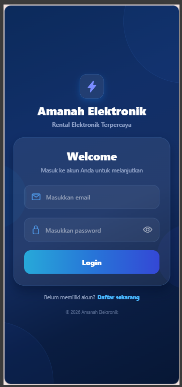
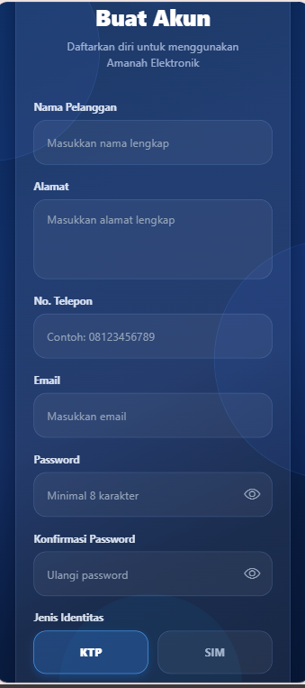
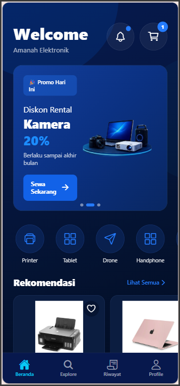
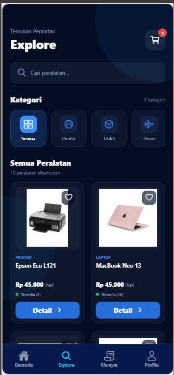
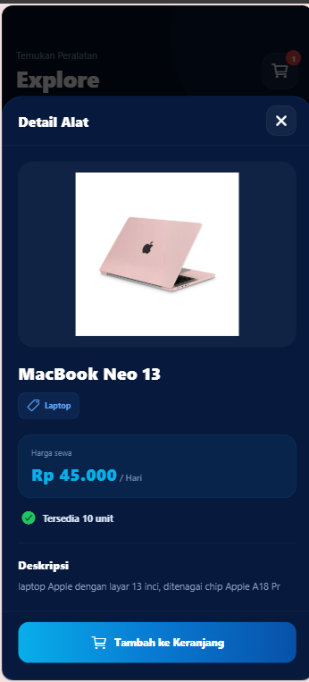
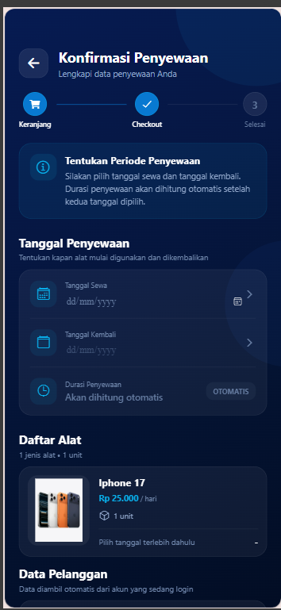
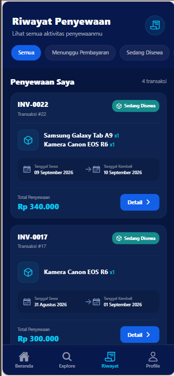
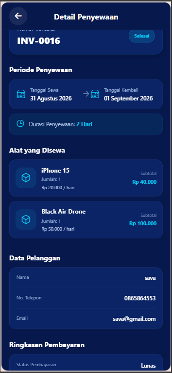
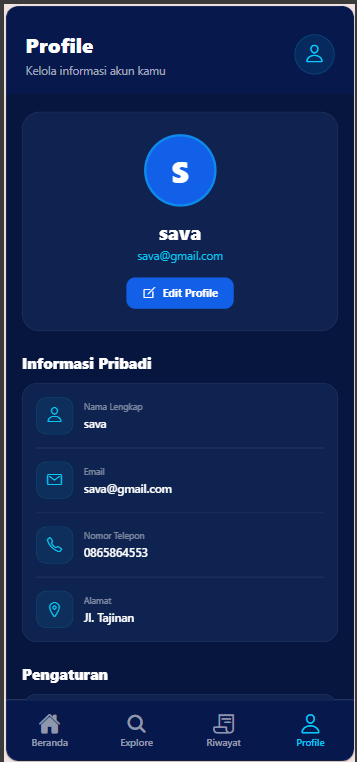

# Amanah Elektronik — Mobile App

Aplikasi mobile pelanggan untuk **Amanah Elektronik**, yang digunakan untuk melihat perangkat yang tersedia, melakukan penyewaan, serta memantau transaksi penyewaan.

## Tentang

Amanah Elektronik Mobile merupakan aplikasi **customer** yang terintegrasi dengan REST API untuk mendukung proses penyewaan perangkat elektronik secara mobile.

Aplikasi ini dibuat sebagai bagian dari **Amanah Elektronik Rental Management System**, yang terdiri dari backend API, admin web, dan aplikasi mobile pelanggan.

## Fitur

* Register pelanggan
* Login pelanggan
* Beranda aplikasi
* Daftar perangkat elektronik
* Detail perangkat
* Checkout penyewaan
* Konfirmasi penyewaan
* Riwayat penyewaan
* Detail penyewaan
* Profil pelanggan
* Edit profil
* Integrasi REST API

## Teknologi

* React Native
* Expo
* TypeScript
* Expo Router
* Axios
* AsyncStorage
* RESTful API
* JavaScript / TypeScript

## Tampilan

### Login

### Register

### Home

### Daftar Alat

### Detail Alat

### Checkout

### Riwayat Penyewaan

### Detail Penyewaan

### Profil

## Backend

Aplikasi mobile ini menggunakan REST API dari:

**Amanah Elektronik API — Laravel**

Repository backend:

**amanah-elektronik**

## Repository Terkait

Project Amanah Elektronik terdiri dari tiga repository:

| Repository                   | Teknologi           | Keterangan         |
| ---------------------------- | ------------------- | ------------------ |
| **amanah-elektronik**        | Laravel             | Backend & REST API |
| **amanah-elektronik-admin**  | React.js            | Admin Web          |
| **amanah-elektronik-mobile** | React Native & Expo | Aplikasi Pelanggan |

## Peran Saya

* Mengembangkan aplikasi mobile pelanggan menggunakan React Native.
* Membuat tampilan antarmuka aplikasi.
* Mengembangkan navigasi menggunakan Expo Router.
* Mengintegrasikan aplikasi dengan REST API.
* Mengimplementasikan autentikasi pelanggan.
* Mengembangkan alur penyewaan dari pemilihan alat hingga checkout.
* Mengembangkan halaman riwayat dan detail penyewaan.
* Mengembangkan fitur profil pelanggan.

## Status

**Completed — Portfolio Project**

Project ini merupakan bagian dari sistem **Amanah Elektronik Rental Management System**.
